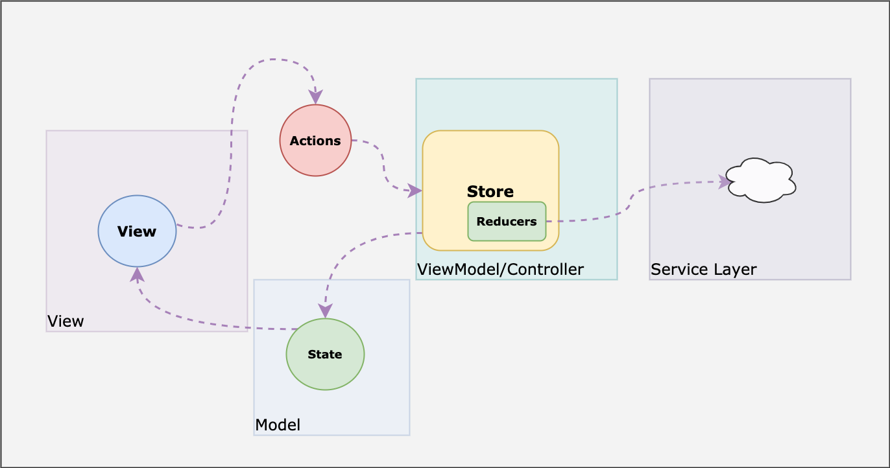
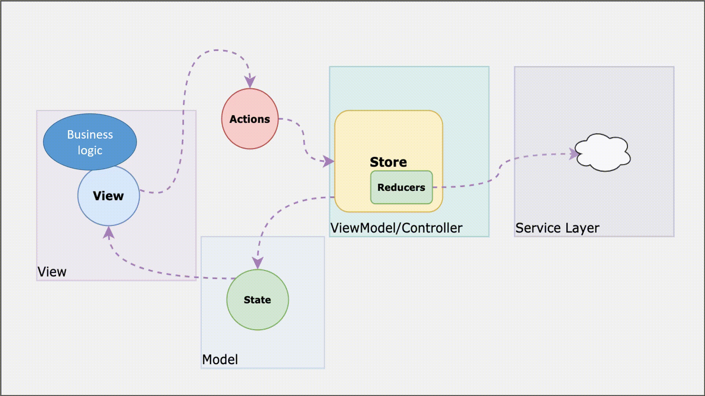
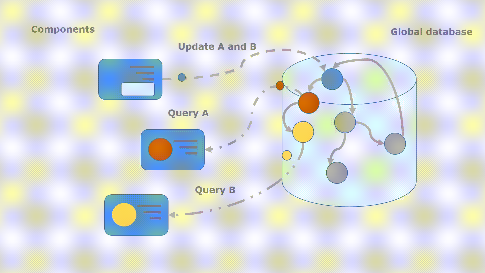
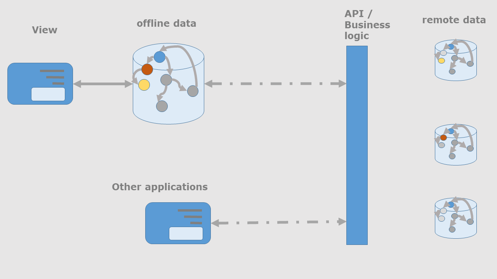

# Core concepts

* A thin client
* Offline data

## Thin client
While increasingly JS running on Browsers can no longer be legitimately called thin client, Our website is becoming more and more thin client. Our website hosts mainly user interface code while majority of the business logic resides in the service layer. Our service layer also services other programs that accesses our services using our API.
Given this scenario, a need for complex state management library that handles business logic within the JS code is reducing, and becoming an overhead.

### Lets look at our usage of Redux
Redux is known to be inspired from Flux which in turn was created to solve the lack of clarity of other types of architecture such as MVC, MVVM.
Are we using Redux to achieve MVVM,

[redux style guide: Put as Much Logic as Possible in Reducers](https://redux.js.org/style-guide/style-guide#put-as-much-logic-as-possible-in-reducers)
> Wherever possible, try to put as much of the logic for calculating a new state into the appropriate reducer, rather than in the code that prepares and dispatches the action (like a click handler)

#### Think of the state tree as a sort of global database
[redux style guide: Organize State Structure Based on Data Types, Not Components](https://redux.js.org/style-guide/style-guide#organize-state-structure-based-on-data-types-not-components)
> Root state slices should be defined and named based on the major data types or areas of functionality in your application, not based on which specific components you have in your UI. This is because there is not a strict 1:1 correlation between data in the Redux store and components in the UI, and many components may need to access the same data. Think of the state tree as a sort of global database that any part of the app can access to read just the pieces of state needed in that component.

## Offline data
Views will need a fragment of it's relevant data to display. The concept of remote servers, api, ... are hidden from the perspective of views. An offline database supplies partial view of the database required by the application. Offline store is responsible for fetching and updating data from service layer.

## What we want for client side state management
* Single source of truth
* Caching
* Deduping of requests
* Notifying the subscribers of the change in data.
* Optimistic response which can fill the UI (partially), until the actual response is received from an api call.

## Libraries that we looked into to implement the stated concepts
* [Redux](https://redux.js.org/) - use redux under the hood and reduce the boiler plate code
* Contexts based - [Recoil.js](https://recoiljs.org/)
* [React Query](https://react-query.tanstack.com/) - being implemented
* [Apollo graphql](https://www.apollographql.com/docs/react/local-state/local-state-management/) is being considered now.
